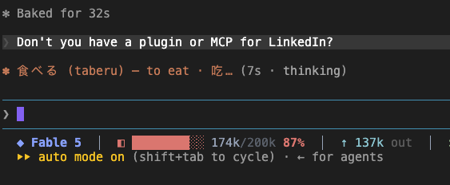

# Spinner Sensei 🈴

Turn your Claude Code spinner into a language tutor. While Claude works, the
little spinner verb becomes a vocabulary flashcard:



```
勉強 (benkyō) — study · 学习
一生懸命 (isshōkenmei) — with all one's might · 拼命
上手 (jōzu) — skilled · 擅长
```

Words rotate on a schedule you choose. Rotation runs in a `SessionStart` hook as
a tiny local Python script — **zero token cost**, no network calls.

## What it does

- Ships a bundled Japanese pool of ~460 words, tagged by JLPT level (N5/N4/N3),
  each with English and Chinese (simplified) meanings, macron rōmaji, and an
  example sentence (surfaced by the `with_example` display format).
- Walks the pool sequentially so you don't see the same word twice until you've
  been through the whole thing, then wraps — with a configurable slice of each
  batch resurfaced from words you've already seen (spaced review).
- Writes exactly one key — `spinnerVerbs` — into your `~/.claude/settings.json`,
  atomically. It never touches anything else, and if your settings file is ever
  malformed it does nothing at all.
- Generates pools for **other languages** on demand via the configure skill.

## Install

```
/plugin marketplace add rickyzzzzz/spinner-sensei
/plugin install spinner-sensei@spinner-sensei
```

When you enable it, you'll be asked four questions:

| Setting | Default | Options |
|---|---|---|
| `target_language` | `japanese` | Only `japanese` ships with a bundled pool; others are generated by the skill. |
| `level` | `N5` | `N5` \| `N4` \| `N3` \| `all` (exact-level filter; `all` mixes). |
| `meaning_language` | `english` | Comma-separated for more than one, e.g. `english, chinese`. Bundled pool supports `english` and `chinese`. |
| `words_per_batch` | `20` | 5–60 words per rotation. |

## Configure

Run `/spinner-sensei:configure` any time to:

- **Show** your current settings and progress.
- **Change** any setting — including ones not asked at install:
  - `cadence_days` — 1 = daily, 7 = weekly, etc.
  - `display_format` — `full` (`勉強 (benkyō) — study`), `recognition`
    (`勉強 (benkyō)`), `no_romaji` (`勉強 — study`), or `with_example`
    (`勉強 (benkyō) — study · 学习 · 毎日勉強します (mainichi benkyō shimasu) I study every day`)
    to add an example sentence on top of the meaning gloss.
  - `spinner_mode` — `append` (adds to Claude's built-in verbs) or `replace`.
  - `review_ratio` — fraction of each batch resurfaced from seen words (0.0–0.9).
- **Generate a pool** for a new language (Spanish, Korean, French, …).
- **Add custom words** (paste a list or an Anki export).
- **Progress / stats** — how many words you've seen, estimated pool-exhaustion date.
- **Rotate now**, or **pause / resume**.

Changes apply immediately (the skill force-rotates for you).

## Transparency

Spinner Sensei edits your settings by writing **one key** — `spinnerVerbs` — into
`~/.claude/settings.json`, using a temp-file + atomic-rename so a partial write
can never corrupt the file. Every other key is left byte-for-byte unchanged, and
a malformed settings file is left completely untouched. The entire runtime is a
single stdlib-only Python script: [`scripts/rotate.py`](scripts/rotate.py). No
network, no telemetry.

## Requirements

- `python3` on your `PATH` (3.6+; standard library only).
- Tested on macOS and Linux. Windows is best-effort — it works as long as
  `python3` is callable. No scheduler or background daemon is needed: the
  `SessionStart` hook *is* the scheduler, so rotation happens the next time you
  start a Claude Code session after the cadence window elapses.

## Uninstall

```
/plugin uninstall spinner-sensei@spinner-sensei
```

Uninstalling removes the plugin and its data directory, but Claude Code cannot
edit your `settings.json` for you, so remove the leftover `spinnerVerbs` key
yourself (or ask `/spinner-sensei:configure` to do it before you uninstall) to
return to the default spinner.

## License

MIT © rickyzzzzz. See [LICENSE](LICENSE).
